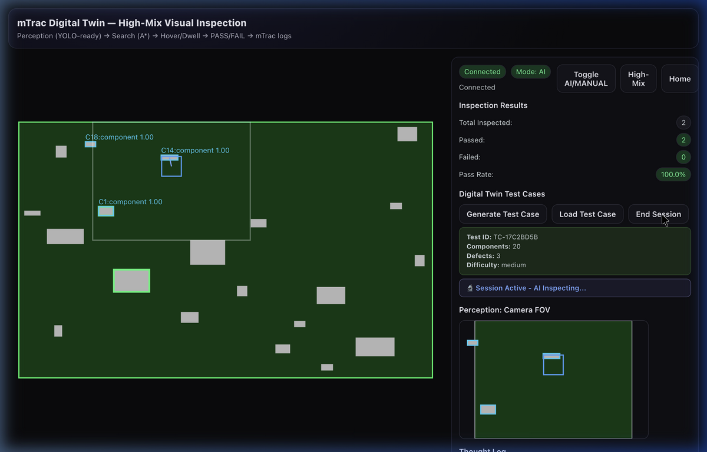

# mTrac Digital Twin — High-Mix Visual Inspection

> **An LLM-powered AI gantry** that inspects PCBA (printed circuit board assemblies) in a 2D digital-twin simulation, inspired by **SP Manufacturing's high-mix PCBA lines**.


---

## 🎬 Demo

https://github.com/user-attachments/assets/mtrac_demo.mp4

<p align="center">
  <video src="./mtrac_demo.mp4" width="800" controls autoplay loop>
    Your browser does not support the video tag. <a href="./mtrac_demo.mp4">Download the demo video</a>.
  </video>
</p>

> The demo shows the full AI inspection lifecycle: **Generate Test Case → Load Board → AI Gantry Inspection → End Session with Metrics**. The gantry autonomously navigates the board, detects components using vision perception, and produces PASS/FAIL inspection results in real time.

<p align="center">
  
</p>

---

## ✨ Key Features

| Feature | Description |
|---------|-------------|
| **Digital Twin Simulation** | 2D top-down PCBA inspection with realistic component layouts and defect scenarios |
| **LLM-Powered AI Brain** | Multi-provider support (Gemini, OpenAI, Anthropic) for intelligent inspection decisions |
| **Real-Time Inspection** | Live gantry movement, dwell-based inspection, and PASS/FAIL results streamed via WebSocket |
| **Test Case Generator** | Randomly generates boards with 8 defect types, configurable difficulty, and component counts |
| **A\* Path Planning** | Obstacle-aware pathfinding with scan-pattern fallback for full board coverage |
| **Perception Pipeline** | Ground-truth vision system with optional YOLO adapter for real CV inference |
| **Session Analytics** | Comprehensive logging of inspection events, detection rates, and performance metrics |
| **Electron + React UI** | Modern dark-themed interface with live board canvas, camera FOV, thought log, and AI trace |

---

## 🏗️ Architecture

```
┌──────────────────────────────────────────────────────────────┐
│                         Electron App                         │
│  ┌──────────────────────┐  ┌──────────────────────────────┐  │
│  │     Board Canvas      │  │         Side Panel           │  │
│  │  (components, path,   │  │  • Inspection Results        │  │
│  │   camera FOV, labels) │  │  • Digital Twin Test Cases   │  │
│  │                       │  │  • Camera FOV Mini-map       │  │
│  │                       │  │  • Thought Log               │  │
│  │                       │  │  • AI Prompt / JSON Trace    │  │
│  └──────────┬───────────┘  └──────────────┬───────────────┘  │
│             │  WebSocket (20 Hz state)     │  Control msgs    │
└─────────────┼─────────────────────────────┼──────────────────┘
              ▼                             ▼
┌──────────────────────────────────────────────────────────────┐
│                    FastAPI + WebSocket Server                 │
│  ┌──────────────────────────────────────────────────────┐    │
│  │                     Runtime                           │    │
│  │  ┌─────────┐  ┌──────┐  ┌────────┐  ┌────────────┐  │    │
│  │  │  World   │  │ Body │  │  Agent │  │  AI Brain  │  │    │
│  │  │ (PCBA)   │  │(gantry)│ │(inspect)│ │  (LLM)    │  │    │
│  │  └─────────┘  └──────┘  └────────┘  └────────────┘  │    │
│  │  ┌──────────┐  ┌──────────┐  ┌────────────────────┐  │    │
│  │  │ Planner  │  │  Vision  │  │  Test Generator    │  │    │
│  │  │  (A*)    │  │ (GT/YOLO)│  │  (random defects)  │  │    │
│  │  └──────────┘  └──────────┘  └────────────────────┘  │    │
│  └──────────────────────────────────────────────────────┘    │
│  HTTP endpoints: /test_case_result, /load_result, /health    │
└──────────────────────────────────────────────────────────────┘
```

### Embodied AI Loop (20 Hz)

```
Sense → Perceive → Decide → Act → Inspect
  │         │          │        │        │
  │    Vision FOV   A* plan  Move    Dwell on component
  │    detections   + LLM    body    until threshold → PASS/FAIL
  │                 trace
  └─ Robot pose (x, y) on the board
```

---

## 🚀 Quick Start

### Prerequisites

- **Python 3.9+**
- **Node.js 16+**
- An API key for at least one LLM provider (Gemini, OpenAI, or Anthropic)

### 1. Clone

```bash
git clone https://github.com/Aneek1/mTrack_SP.git
cd mTrack_SP
```

### 2. Backend

```bash
# (Optional) Create a virtual environment
python3 -m venv venv && source venv/bin/activate

# Install dependencies
pip install -r backend/requirements.txt

# Configure environment
cp backend/.env.example backend/.env
# Edit backend/.env with your API key:
#   LLM_PROVIDER=gemini
#   GEMINI_API_KEY=your_key
```

### 3. Frontend

```bash
cd ui && npm install && cd ..
```

### 4. Run

```bash
# Option A — single command (needs chmod +x dev.sh)
./dev.sh

# Option B — two terminals
# Terminal 1: backend
bash dev_backend.sh

# Terminal 2: frontend
bash dev_ui.sh
```

### 5. Use

1. Open **http://localhost:5173** in your browser
2. Click **"Generate Test Case"** — a random PCBA board is created
3. Click **"Load Test Case"** — the board loads and AI inspection begins
4. Watch the AI gantry move, inspect components, and update **Inspection Results** in real time
5. The **Thought Log** shows the AI's reasoning; the **Prompt/JSON Trace** shows raw LLM output
6. Click **"End Session"** to see final performance metrics

---

## 🔧 Configuration

### Environment Variables

| Variable | Default | Description |
|----------|---------|-------------|
| `LLM_PROVIDER` | `openai` | LLM backend: `gemini`, `openai`, or `anthropic` |
| `GEMINI_API_KEY` | — | Google Gemini API key |
| `OPENAI_API_KEY` | — | OpenAI API key |
| `ANTHROPIC_API_KEY` | — | Anthropic API key |
| `MTRAC_YOLO_WEIGHTS` | — | Path to YOLO `.pt` weights (optional) |
| `PORT` | `8765` | Backend server port |

### LLM Providers

| Provider | Model | Cost / Session | Speed | Best For |
|----------|-------|---------------|-------|----------|
| **Gemini** | 1.5 Flash | ~$0.01 | Very Fast | Cost-sensitive, high-volume |
| **OpenAI** | GPT-4o-mini | ~$0.03 | Fast | Balanced performance |
| **Anthropic** | Claude-3-haiku | ~$0.05 | Medium | Quality-critical |

---

## 📂 Project Structure

```
mTrac_SP/
├── backend/
│   ├── server.py              # FastAPI + WebSocket server, Runtime orchestrator
│   ├── schemas.py             # Pydantic models for control/state messages
│   ├── requirements.txt
│   ├── .env.example
│   └── sim/
│       ├── agent.py           # HighMixInspectionAgent — sense/perceive/decide/act loop
│       ├── body.py            # RobotBody — gantry kinematics and mode switching
│       ├── brain.py           # InspectionAI — LLM prompt builder + JSON parser
│       ├── planner.py         # AStarPlanner — grid-based A* pathfinding
│       ├── vision.py          # GroundTruthVisionSystem, YoloVisionSystem (optional)
│       ├── world.py           # PCBAWorld — board state, components, defect map
│       ├── geometry.py        # Rect primitive for bounding boxes
│       ├── test_generator.py  # TestCaseGenerator — random PCBA defect scenarios
│       └── digital_twin_logger.py  # Session logging and analytics
├── ui/
│   ├── electron/main.ts       # Electron shell
│   ├── src/
│   │   ├── App.tsx            # Root React component
│   │   ├── components/
│   │   │   ├── BoardCanvas.tsx  # Main 2D board renderer
│   │   │   └── SidePanel.tsx    # Controls, results, thought log, AI trace
│   │   ├── render.ts          # Canvas drawing helpers
│   │   ├── types.ts           # TypeScript type definitions
│   │   └── ws.ts              # WebSocket client
│   ├── vite.config.ts         # Vite config with API proxy to backend
│   └── package.json
├── simulation/                # Legacy pygame prototype
├── docs/                      # Screenshots and documentation assets
├── mtrac_coo_demo.webp        # Demo video (animated WebP)
├── dev.sh                     # Start backend + frontend together
├── dev_backend.sh             # Start backend only
├── dev_ui.sh                  # Start frontend only
└── main.py                    # Legacy pygame entry point
```

---

## 🧪 Digital Twin Test Cases

The **Test Case Generator** creates realistic inspection scenarios:

- **8 defect types**: missing component, misalignment, solder defect, damage, contamination, wrong component, orientation error, size variation
- **4 severity levels**: critical, major, minor, cosmetic
- **Configurable parameters**: board size, component count (5–50), defect rate, difficulty level (easy / medium / hard)
- **Automatic loading**: clicking "Generate Test Case" creates a board AND loads it into the simulation — the AI starts inspecting immediately

### How Inspection Works

1. The **gantry** starts at (0, 0) and scans the board using A\* waypoints
2. When a component enters the **camera FOV** (320×240 px), the vision system detects it
3. The agent targets the component center and **dwells** for 0.6 seconds
4. After dwelling, the component is inspected — **PASS** or **FAIL** based on ground-truth defect data
5. The **Inspection Results** panel updates in real time
6. The **Thought Log** and **AI Trace** show the LLM's decision-making process

---

## 🔌 API Reference

### WebSocket (`ws://localhost:8765/ws`)

**Server → Client** (20 Hz): `ServerStateMsg` with board, components, detections, body pose, inspection results, AI trace, and thought log.

**Client → Server** control messages:

| Type | Description |
|------|-------------|
| `toggle_mode` | Switch between AI and MANUAL |
| `manual_velocity` | Set gantry velocity (dx, dy ∈ {-1, 0, 1}) |
| `set_target` | Click-to-move target on the board |
| `generate_test_case` | Generate a random PCBA test scenario |
| `load_test_case` | Load a test case into the simulation |
| `end_test_session` | End the current session and get metrics |
| `change_profile` | Reshuffle components (high-mix mode) |
| `home` | Return gantry to origin |
| `set_ai_enabled` | Enable/disable AI control |
| `set_yolo_weights` | Switch perception to YOLO (optional) |

### HTTP Endpoints

| Endpoint | Method | Description |
|----------|--------|-------------|
| `/health` | GET | Server health check |
| `/test_case_result` | GET | Last generated test case details |
| `/load_result` | GET | Last load operation result |
| `/session_result` | GET | Last session end metrics |
| `/current_test_case` | GET | Info about the active test case |

---

## 🤖 YOLO Vision (Optional)

The default vision system uses **ground-truth detections** — no ML dependencies required. To enable YOLO:

```bash
pip install -r requirements-yolo.txt
# Set the weights path:
export MTRAC_YOLO_WEIGHTS=/path/to/best.pt
```

The YOLO adapter in `backend/sim/vision.py` currently falls back to ground truth; replace `YoloVisionSystem.infer()` with real image rendering + inference for production use.

---

## 🛠️ Troubleshooting

| Problem | Solution |
|---------|----------|
| **Port 8765 in use** | `lsof -i :8765` then `kill -9 <PID>` |
| **WebSocket disconnects** | Refresh the browser; backend auto-reconnects |
| **API key errors** | Verify `backend/.env` has the correct key and `LLM_PROVIDER` matches |
| **UI shows 0 inspected** | Ensure backend is running (`curl localhost:8765/health`) |
| **Frontend can't reach backend** | Check `ui/vite.config.ts` proxy is set to `http://127.0.0.1:8765` |

---

## 📄 Additional Documentation

- **[ALGORITHM_ANALYSIS.md](./ALGORITHM_ANALYSIS.md)** — Deep dive into A\*, LLM integration, and inspection logic
- **[DIGITAL_TWIN_GUIDE.md](./DIGITAL_TWIN_GUIDE.md)** — Test case generation, session analytics, and benchmarking
- **[LLM_SETUP.md](./LLM_SETUP.md)** — Detailed LLM provider configuration and cost analysis

---

## 📜 License

MIT
